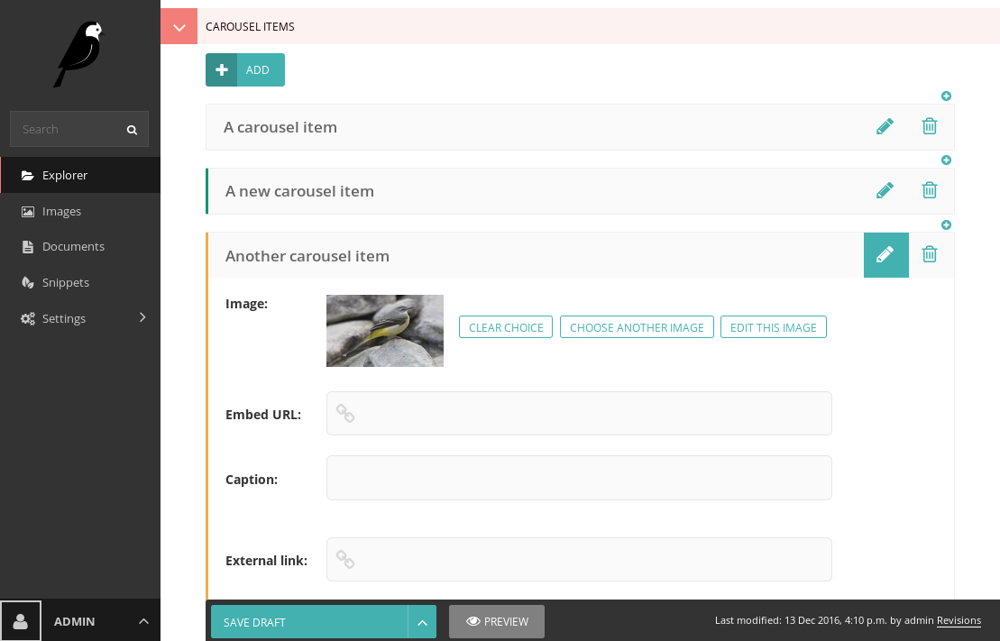

# Condensed InlinePanel for Wagtail CMS

This repository contains a drop-in replacement for Wagtail's ``InlinePanel``.
It's designed with a lighter interface that's suitable for cases where there
may be hundreds of items in the panel.



## Features

 - Fast, react-based UI which hides away forms that aren't being used
 - Drag and drop reordering
 - Add a new item at any point

## Installation

Firstly, install the module with PIP:

```shell
pip install wagtail-condensedinlinepanel==0.5.2
```

Then, add ``condensedinlinepanel`` to your ``INSTALLED_APPS``:

```python
# settings.py


INSTALLED_APPS = [
    ...

    'condensedinlinepanel',

    ...
]
```

Then, finally, import the edit handler and use it. ``CondensedInlinePanel`` can be used as a drop-in replacement for Wagtail's built-in ``InlinePanel``:

```python
# models.py

...

from condensedinlinepanel.edit_handlers import CondensedInlinePanel

...

class MyPage(Page):
    ...

    content_panels = [
        ...

        CondensedInlinePanel('carousel_items', label="Carousel items", card_header_from_field="title"),
    ]
